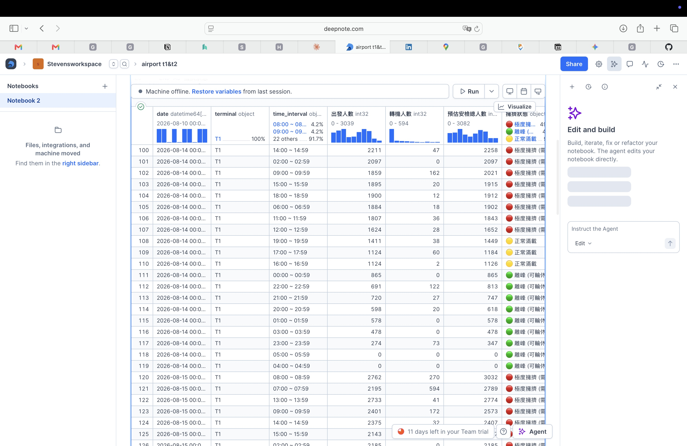
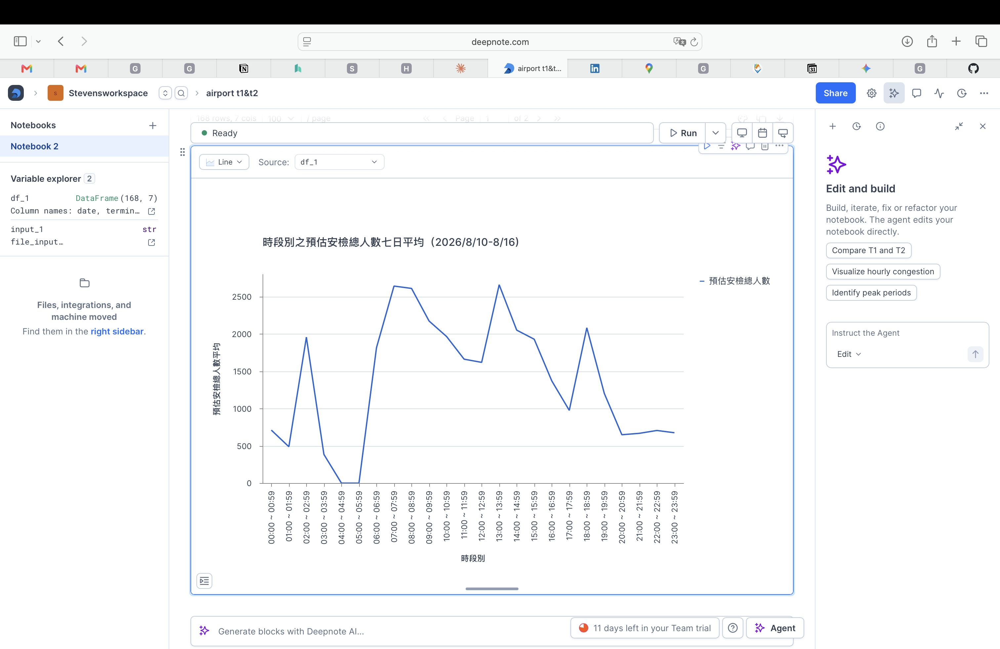

Markdown
# ✈️ 機場第一航廈 (T1) 安檢人流預估與排班優化分析

## 專案背景與目標
機場安檢站的擁擠程度直接影響旅客體驗與航班準點率。本專案透過分析 T1 航廈的歷史出發與轉機人數數據，建立「安檢人流量預警模型」。
目標是提早識別出每日的尖峰時段，並透過紅綠燈系統 (Traffic Light System) 將擁擠程度視覺化，提供航警局與地勤單位作為**人員排班與增派支援**的數據決策依據。

## 工具與技術
* **資料庫/環境:** Deepnote, SQL
* **核心 SQL 技巧:**
  * `CTE (WITH)`: 將資料清洗與邏輯運算分層，提升程式碼可讀性。
  * `Data Cleaning`: 使用 `CAST` 轉換資料型態，並以 `COALESCE` 處理缺失值 (NULL)，避免計算加總時產生錯誤。
  * `Conditional Logic`: 使用 `CASE WHEN` 建立自定義的商業邏輯標籤。

## 核心商業邏輯定義
為了讓第一線管理人員快速反應，本專案將「預估安檢總人數（出發人數 + 轉機人數）」定義為三個警戒級別：
* 🔴 **極度擁擠 (>= 1500人)：** 需立即增派安檢線支援。
* 🟡 **正常滿載 (1000 - 1499人)：** 維持現有人力，密切觀察。
* 🟢 **離峰可輪休 (< 1000人)：** 可安排人員用餐或輪休。

## 數據洞察與視覺化

### 1. 各時段擁擠狀態評估 (資料預覽)
*(在此展示透過 SQL 轉換後的資料表，具備明確的紅綠燈警示)*

### 2. 每日安檢尖峰時段趨勢
*(在此展示七日平均趨勢折線圖)*

### 💡 營運建議 (Actionable Insights)
1. **雙峰現象預警：** 從趨勢圖可知，每日呈現早午雙峰分佈（如 07:00-08:59 及 13:00-15:59）。建議管理層在此兩個時段的前 30 分鐘，提早完成人員交接班，並全員上線待命。
2. **離峰人力優化：** 晚間 20:00 後至凌晨多為🟢離峰狀態，可大幅縮減排班人力，降低營運成本或安排設備檢修。
